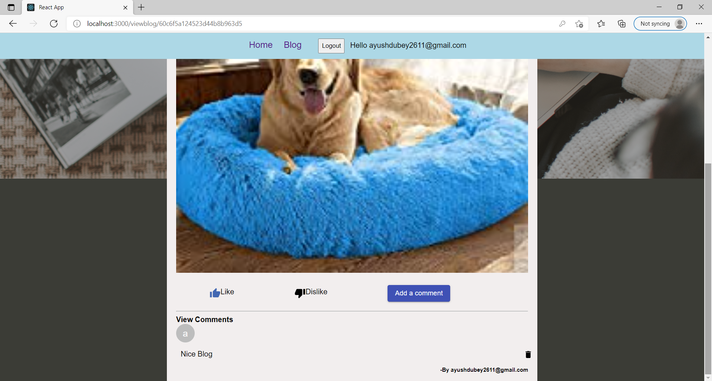

## mern-blog README :


### `This is a MERN stack blog application`

- **Getting Started with React**: <a href="https://github.com/AyushDubey-maker/mern-blog/blob/master/frontend/client/README.md"> </a>

### `Packages installed (frontend):`
```
npm install
```
```
@material-ui/core
@material-ui/icons
axios
react-dom
react-router-dom
```
### `Packages installed (backend):`
```
npm install
```
```
bcrypt
cookie-parser 
cors 
dotenv 
express
jsonwebtoken 
mongoose
multer
```
<details>
<summary>
View Code Output:
</summary>
Homepage:

Login:

Register:


Blog Form:


Blog Landing Page:

</details>

>### Features 📣:
- Auth provided by jsonwebtoken with password hashing.
- Users can view all blogs on homepage.
- Users can create and view their blogs.
- Blog Landing Page consists of 'like' and 'comment' feature too.


